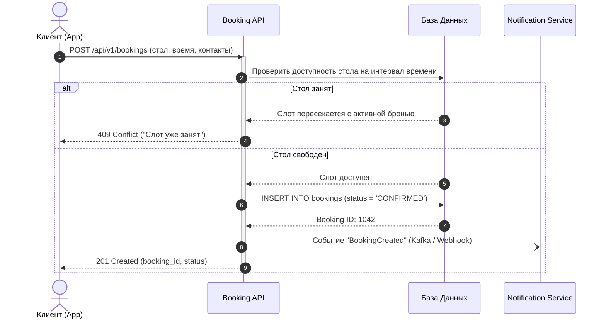

# Взаимодействие при бронировании

```mermaid
sequenceDiagram
    autonumber
    actor Client as Клиент (App)
    participant API as Booking API
    participant DB as База Данных
    participant Notify as Notification Service

    Client->>API: POST /api/v1/bookings (стол, время, контакты)
    activate API
    API->>DB: Проверить доступность стола на интервал времени
    alt Стол занят
        DB-->>API: Слот пересекается с активной бронью
        API-->>Client: 409 Conflict ("Слот уже занят")
    else Стол свободен
        DB-->>API: Слот доступен
        API->>DB: INSERT INTO bookings (status = 'CONFIRMED')
        DB-->>API: Booking ID: 1042
        API-)Notify: Событие "BookingCreated" (Kafka / Webhook)
        API-->>Client: 201 Created (booking_id, status)
    end
    deactivate API
```